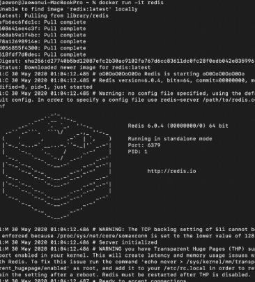

# 도커를 사용하는 이유

- 어떠한 프로그램을 다운 받는 과정을 굉장히 간단하게 만들어 주기 때문이다.
- 컨테이너를 사용하여 애플리케이션의 배포와 관리를 쉽게 도와주기 때문이다.

### 도커 없이 프로그램을 받고 실행하는 순서

- Installer 다운
- Installer 실행
- 프로그램 설치 완료

but..

__갖고 있는 서버, 패키지 버전, 운영체제 등에 따라 프로그램을 설치하는 과정중에 많은 에러들이 발생하게 된다. 또한 설치 과정도 복잡하다.__

### 도커 없이 Redis 를 받는 경우

- Redis 홈페이지로 이동 -> redis.io
- Installation : redis.io > download 에 설치 방법이 명시되어있음
    - ```
      $ wget http://downlaod.redis.io/realease/redis-6.0.4.tar.gz
      $ tar xzf redis-6.0.4.tar.gz
      $ cd redis-6.0.4
      $ make
      ```
    - wget 등의 명령어들이 설치가 안되어있으면 설치를 해줘야함.
    - 생략..

### 도커를 사용하여 Redis 를 받는 경우

- docker run -it redis
- 
- 다운로드 완료
