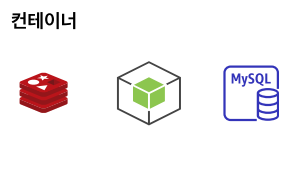

# 도커란?

`컨테이너`를 사용하여 응용프로그램을 더 쉽게 만들고 배포하고 실행할 수 있또록 설계된 도구이며 `컨테이너` 기반의 오픈소스 가상화 플랫폼이다.

그림 처럼 컨테이너 안에 다양한 프로그램, 실행환경을 `컨테이너로 추상화`하고 동일한 인터페이스를 제공하여 `프로그램의 배포 및 관리`를 단순하게 해준다.

> AWS, Azure, Google Cloud 등 어디서든 실행 가능하게 해준다.

## 도커 이미지와 도커 컨테이너

`컨테이너`는 코드와 모든 종속성을 패키지화하여 응용 프로그램이, 한 컴퓨팅 환경에서 다른 컴퓨팅 환경으로 빠르고 안정적으로 실행되도록 하는 소프트웨어의 표준 단위이다.

> 쉽게 말해, 간단하고 편리하게 프로그램을 실행 시켜주는 것으로 이해하면 된다.

`컨테이너 이미지`는 코드, 런타임, 시스템 도구, 시스템 라이브러리 및 설정과 같은 응용 __프로그램을 실행하는 데 필요한 모든 것을 포함__ 하는 가볍고 독립적이며 실행 가능한 소프트웨어 패키지이다.

> 컨테이너 이미지는 런타임에 컨테이너가 되고, 도커 컨테이너의 경우 도커 엔진에서 실행될 때 이미지가 컨테이너가 된다.

컨테이너는 `소프트웨어를 환경으로부터 격리시키고` 개발과 스테이징의 차이에도 불구하고 균일하게 작동하도록 보장한다.