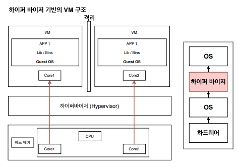
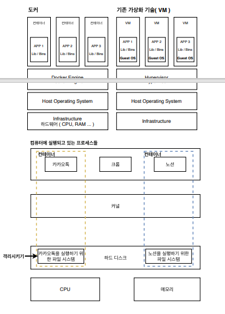

# 도커와 기존의 가상화 기술과의 차이를 통한 컨테이너 이해

- __가상화 기술이 나오기 전__
    - 한대의 서버를 하나의 용도로만 사용
    - 남는 서버 공간 그대로 방치
    - 안정적 But .. 비효율적
- __하이퍼 바이저 기반의 가상화 출현__
    - 논리적으로 공간을 분할하여 Virtual Machine 이라는 독립적인 가상 환경의 서버 이용 가능
    - 하이퍼 바이저는 호스트 시스템에서 다수의 게스트 OS 를 구동할 수 있게 하는 소프트웨어
    - 하드웨어를 가상화하면서 하드웨어와 각각의 VM 을 모니터링하는 중간 관리자이다.

> 하이퍼 바이저에 의해 구동되는 VM 은 각 VM 마다 독립된 가상 하드웨어 자원을 할당 받는다. 논리적으로 분리 되어 있어서 한 VM 에 오류가 발생해도 다른 VM 으로 퍼지지 않는다는 장점이 있다.

## 컨테이너 가상화 기술

- __도커 컨테이너와 가상 머신의 공통점__
    - 기본 하드웨어에서 격리된 환경 내에 애플리케이션을 배치한다.
- __도커 컨테이너와 가상 머신의 차이점__
    - 얼마나 격리 시키는지
    - VM 과 비교했을 때, 컨테이너는 하이퍼 바이저와 Guest OS 가 필요하지 않아서 더 가볍다.
    - 컨테이너 방식에서는 `호스트 OS` 위에 컨테이너 이미지를 배포하기만 하면 된다.
        - 호스트 OS 위에서 구동되기 때문에, `동일한 커널`을 공유한다.
        - Ex. 몽고 DB 컨테이너와 도커를 같이 실행하면 호스트(도커 아님)의 일반 쉘에 `ps-e grep 몽고`를 실행하면 프로세스가 표시된다.
    - 반면에, VM 은 VM 을 띄우고 자원을 할당한 다음, Guest OS 를 부팅하여 애플리케이션을 실행해야 해서 훨씬 복잡하고 무겁다.

## 도커는 어떻게 컨테이너를 격리 시킬까?

먼저 리눅스에서 쓰이는 `C-group(control groups)` 과  `namespaces` 에 대해 알아야 한다.

이것들은 컨테이너와 호스트에서 실행되는 다른 프로세스 사이에 벽을 만드는 리눅스 커널 기능들이다.

> 리눅스 커널에 있던 C-group 과 namespaces 를 컨테이너에서 가져와서 사용하기 때문에 격리를 시킬 수 있는 것이다.

- __C-Group__
    - CPU, 메모리, Network Bandwith, HD i/o 등 프로세스 그룹의 시스템 리소스 사용량을 관리
    - 어떤 어플이 사용량이 너무 많다면 그 애플리케이션 같은 것을 C-group 에 집어 넣어서 CPU 와 메모리 사용 제한 가능
- __네임스페이스(namespaces)__
    - 하나의 시스템에서 프로세스를 격리시킬 수 있는 가상화 기술
    - 별개의 독립된 공간을 사용하는 것 처럼 격리된 환경을 제공하는 경량 프로세스 가상화 기술

