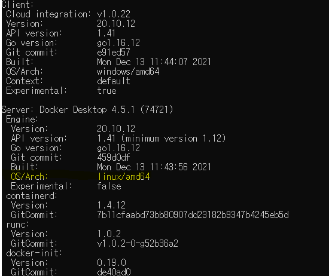
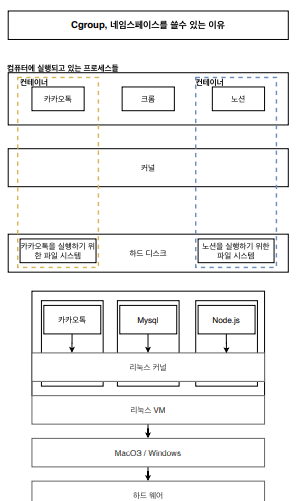

# C-group 과 네임스페이스를 도커 환경에서 쓸 수 있는 이유

`컨테이너를 격리` 시킬 수 있는 이유는 `C-group` 과 `namespaces` 를 이용하기 때문이다. 이 두 개념은 리눅스 환경에서 사용되는 것인데, 컨테이너에서도 리눅스에서 사용하는 이 두 개념을 사용한다.

> 원래는 Linux 에서만 사용 가능한 기능이다.

하지만 나는 Docker 를 윈도우 or Mac OS 에서 사용하고 있다...

터미널에서 `docker version` 을 치면 OS/Arch 가 `linux/amd64` 라고 나와있다.

사실 내부구조가 아래와 같이 되어있다.

도커 클라이언트와 도커 서버는 `리눅스` 환경에서 돌아가고 있다. 따라서  `C-group` 과 `namespaces` 를 사용할 수 있는 것이고, 이 두 기능 덕분에 `컨테이너 격리`(namespaces, C-group)와 `용량 관리`(HDD 용량, RAM 용량 나누는 것 = C-group)가 가능한 것이다.