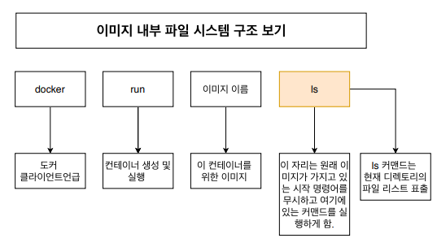
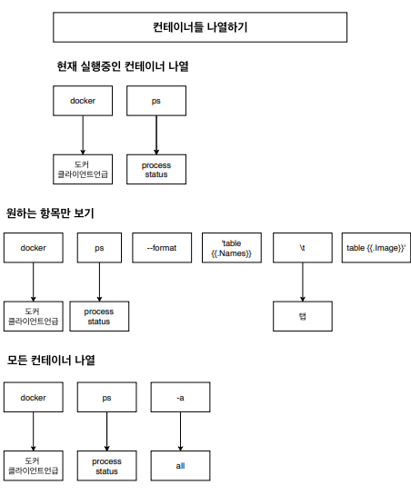
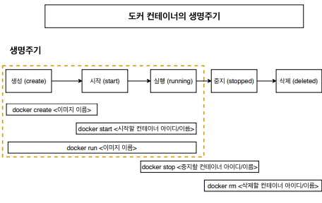
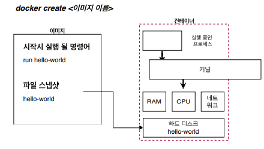
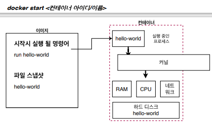
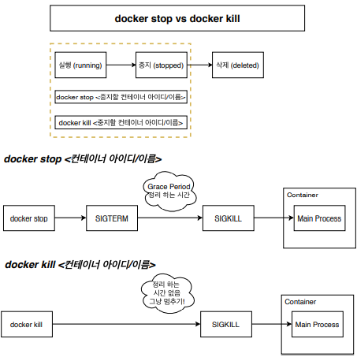
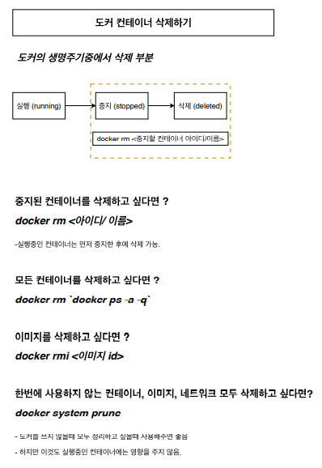

# 도커 클라이언트 명령어

## 컨테이너 실행하기

- docker run `<이미지 이름>` ping localhost

## 이미지 내부 파일 구조 보기

- docker run `<이미지 이름>` ls



## 컨테이너들 나열하기



- docker ps
- 원하는 항목만 보기
    - `docker ps --format 'table{{.Names}}\table{{.Image}}'`
    - ```
      NAMES           ableIMAGE
      quirky_banzai   ablealpine
      ```

## 도커 생명주기



- docker run `<이미지 이름>`
    - docker create `<이미지 이름>` + docker start `<컨테이너아이디/이름>`





## docker stop vs docker kill



- docker stop
    - Stop 은 `Gracefully` 중지를 시킨다.
    - 자비롭게 그동안 하던 작업들을 완료하고 컨테이너를 중지 시킨다.
- docker kill
    - Kill 은 Stop 과 달리 어떠한 것도 기다리지 않고 바로 컨테이너를 중지 시킨다.

## 컨테이너 삭제하기



- docker rm `<Container ID>`
    - Ex. docker rm ecff0f120df8

## 실행 중인 컨테이너에 명령어 전달

이미 실행 중인 컨테이너에 명령어를 전달하고 싶다면 ?

- docker exec `<컨테이너 아이디>` 
    - Ex. docker exec 5a04910c9390 ls
- docker run vs docker exec
    - 1. docker run 은 새로 컨테이너를 만들어서 실행
    - 2. docker exec 은 이미 실행 중인 컨테이너에 명령어를 전달
