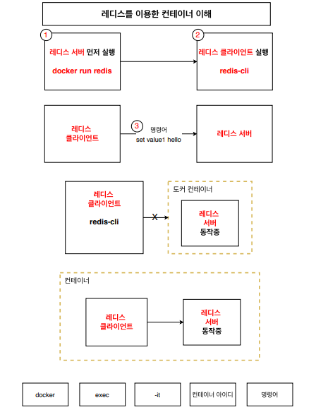
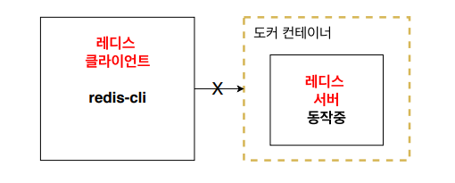
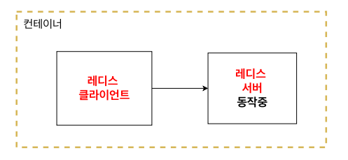
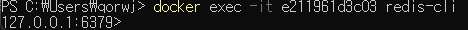

# 레디스를 이용한 컨테이너 이해



- `레디스 서버`가 먼저 작동하고 있어야 함
- 그 후 `레디스 클라이언트` 실행 후 명령어를 레디스 서버에 전달

## 실습

1. 먼저 첫 번째 터미널을 실행 후, 레디스 서버 작동시키기
    - docker run redis
2. 그 후 레디스 클라이언트를 켜야 하므로, 두 번째 터미널을 켜서 레디스 클라이언트 작동시키기
    - redis-cli
3. 하지만 에러 발생..
    - ```
      + CategoryInfo : ObjectNotFound: (redis-cli:String) [], CommandNotFoundException
      + FullyQualifiedErrorId : CommandNotFoundException
      ```

현재 레디스 클라이언트와 서버 상황은 다음과 같다.



레디스 클라이언트가 `컨네이너 밖에 위치`하고 있어서 레디스 서버에 접근할 수 없어서 레디스 클라이언트를 작동하려고하면 에러가 발생하는 것이다.

에러를 해결하기 위해서는 레디스 클라이언트를 컨테이너 안에서 실행시켜야 한다.

## 문제 해결

1. 먼저 첫 번째 터미널을 실행 후, 레디스 서버 작동시키기
    - docker run redis
2. 실행 중인 컨테이너에 명령어를 전달하기 위해서 `exec` 명령어 활용하기
    - docker exec -it `<Container ID>` redis-cli



### it

- docker exec -it `<Container ID>` 명령어
- `-it` 명령어를 붙여줘야 명령어를 실행한 후  계속 명령어를 적을 수 있다.
    - `-i` : interactive(상호적인)
    - `-t` : terminal 



`-it` 를 사용하지 않으면 redis-cli 를 키기만 하고 밖으로 나와버린다.