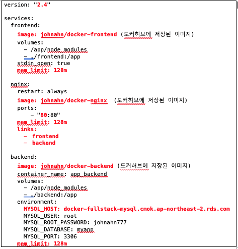

# AWS. ElasticBeanstalk Platform Branch

현재까지 저희가 엘라스틱 빈스톡 환경을 생성할 때, 플랫폼 브랜치를 선택 할 때

단일 컨테이너 애플리케이션을 이용할 떄(6-7강)는 `Docker running on 64bit Amazon Linux` 를 사용했으며

멀티 컨테이너 애플리케이션을 이용할 때(8-9강)는 `Multi-container Docker running on 64but Amazon Linux` 를

사용했습니다.   

하지만 AWS 에서 20201년 7월 8일 부로  앞서 말한 두개의 플랫폼 브랜치의 사용 중단(deprecation)을 발표했습니다.

그리고 2022년 6월 30일 까지만 사용할 수 있게 공지했습니다.

그래서 현재도 6-7강과 8-9강에서 한 부분이 문제 없이 작동하지만,

AWS 에서 새롭게 추천하는 방법이 아니기 때문에 AWS 에서 추천하는 플랫폼 브랜치인 `Docker running on 64bit Amazon Linux2` 를 사용해서 저희가 만든 애플리케이션을 다시 배포해보겠습니다.

플랫폼 브랜치의 교체로 가장 크게 변화가 된 것은 Linux2 플랫폼 브랜치에서는

Dockerrun.aws.json 대신에 docker-compose.yml 을 이용한다는 것입니다.

원래는 Dockerrun.aws.json 파일을 이용해서 도커 허브에 있는 이미 빌드되어있는 이미지를 가져오고 메모리 사이즈나 포트 맵핑 및 볼륨 설정까지 해주었습니다.

그리고 도커 컴포즈 파일은 개발 환경에서 애플리케이션을 쉽게 실행하기 위해서 사용했습니다.

하지만 이제는 `Dockerrun.aws.json` 파일에 명시해놓은 메모리 사이즈 도커 허브에 있는 도커 이미지등을 도커 컴포즈 파일에 명시해주겠습니다.   

1. 먼저는 Dockerrun.aws.json파일과 docker-compose.yml 파일을 비교합니다.

비교하므로써 `Dockerrun.aws.json` 에 명시되어 있는 설정들을 `docker-compose.yml` 으로 옮길수 있습니다.   

2. 먼저 메모리 사이즈를 명시해주겠습니다. 메모리 사이즈를 `docker-compose.yml` 에서 명시할 때는 `mem_limit : <메모리 사이즈>` 로 주시면 됩니다. 각 컨테이너 마다 주겠습니다. 

3. 도커 이미지를 도커 허브에 이미 저장된 이미지를 가져오기 위해서 도커 허브에 저장된 이미지 이름을 명시합니다. 

4. nginx 컨테이너에서 포트맵핑은 80:80으로 해주겠습니다. 그 이유는 nginx 를 사용할 때는 기본적으로 3000번 포트가 아닌 80번 포트에서 애플리케이션이 실행되기 때문입니다. 

5. AWS RDS 서비스로 생성된 데이터베이스와 애플리케이션을 연결하기 위해서 MySQL HOST 정보를 RDS 서비스 페이지에서 가져와서 backend 컨테이너의 MYSQL_HOST 키에 대응하는 값으로 넣어주시면 됩니다.     

공식 설명서는 아래의 링크에 나와있습니다.

https://docs.aws.amazon.com/elasticbeanstalk/latest/dg/docker-multicontainer-migration.html